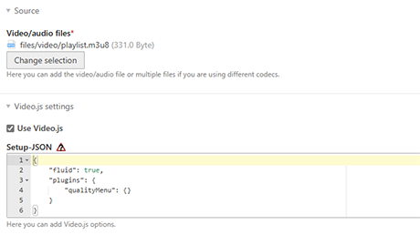

# Adaptive Bitrate Streaming using Video.js

This extension enables adaptive bitrate streaming with [Video.js](https://github.com/videojs/video.js) in contao. It contains the [quality selection menu](https://github.com/videojs/videojs-contrib-quality-menu) that provides a "menu button to the player's control bar which allows you to manually select the playback quality in HLS or Dash sources".

For BC the previous [source selector plugin](https://github.com/FreeTubeApp/videojs-http-source-selector) can still be used.

| Backend                                               | Frontend                                                            |
| ----------------------------------------------------- | ------------------------------------------------------------------- |
|  |  |

## Upgrade from version 1

In version 2, we switched from Mediaelement.js to Video.js and removed the content element `abrstreaming` and the template `js_mediaelement_dash`. You should now use the content element `player` with the template `ce_player.html5` provided by this extension.
